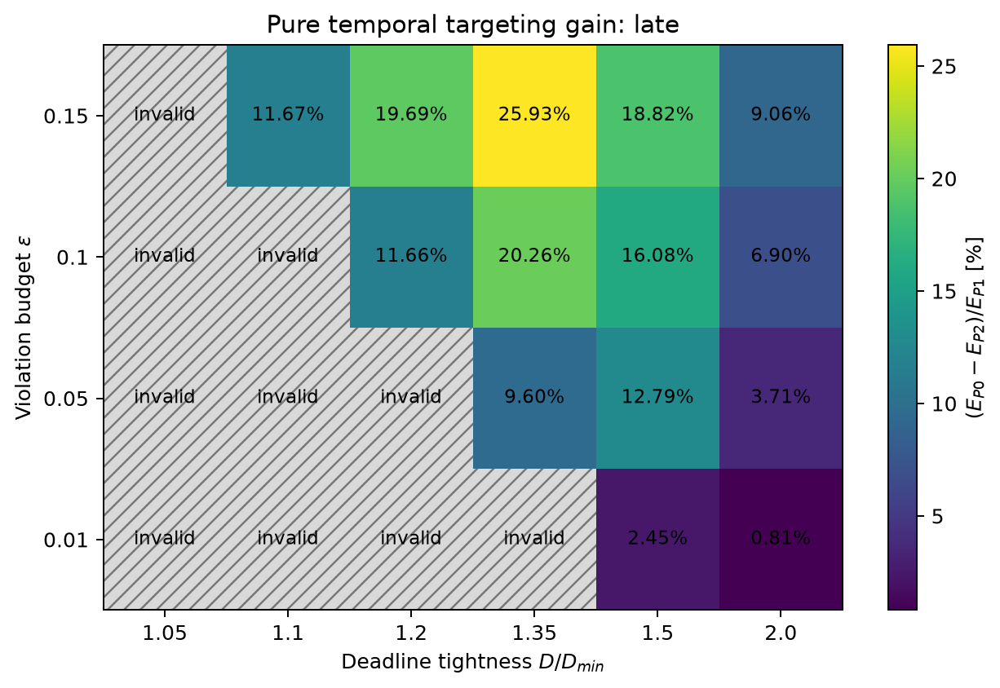
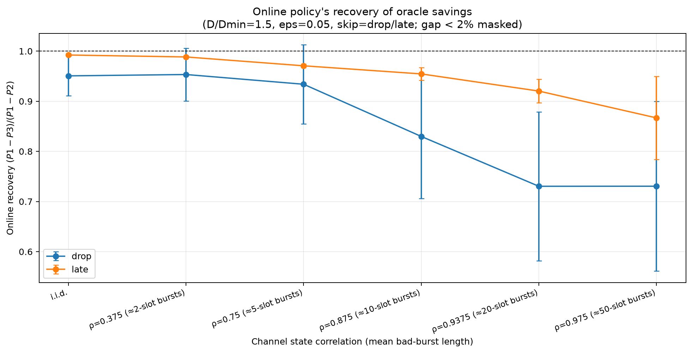

# Energy-efficient DNN split-offloading simulator

This package measures two things about spending a long-run deadline-violation
budget (ε) in DNN split-offloading:

- **(H1a)** the value of temporally targeting violations at expensive slots —
  as a function of deadline tightness and ε. This offline value is provably
  invariant to channel correlation, which we verify as a sanity check.
- **(H1b)** how channel state correlation ρ affects (i) how much of that value
  an online policy can recover, (ii) how violations cluster into bursts, and
  (iii) the energy cost of banning consecutive violations.

The local action space is the product of DNN split point and local execution
mode. The default profile provides `normal` and a faster, higher-energy
`boost` mode. `D_min` is intentionally defined using normal mode only. The
synthetic channel is parameterized directly by lag-1 state autocorrelation ρ
and applies independent clipped-lognormal rate jitter within each state.

## Key results

These results use the committed `full` run (`T=100,000`, 10 seeds). Reported
ranges come from the full-grid CSVs and are not read from a representative
slice. The online-recovery and other line/bar figures use
`D/D_min=1.5, ε=0.05` unless their title says otherwise; the H1a heatmap spans
the full deadline/ε grid.

- **H1a — accepted.** At `ε=0.15`, pure temporal-targeting gain
  `(P0-P2)/P1` rises from **11.7%** at `D/D_min=1.1` to **25.9%** at
  `D/D_min=1.35` under the conservative `late` skip model (ρ-averaged values
  from `comparison_aggregate.csv`: 11.67% and 25.93%). Under `drop`, it spans
  approximately **15–37%** over the same tight-deadline region and reaches
  36.73% at `D/D_min=1.35, ε=0.15`. This exceeds the pre-registered 10
  percentage-point threshold. The gain peaks at `D/D_min=1.35` and grows with
  ε.

  

- **H1b-i — online recovery.** Recovery remains approximately **97–98%** in
  loose, highly correlated regimes (`D/D_min=2.0`, ρ=0.9375–0.975, both skip
  modes), but falls to **58–63%** in the tightest valid high-correlation
  combinations under `late` (`ρ=0.975, ε=0.15`: 58.0% at `D/D_min=1.1` and
  62.9% at `D/D_min=1.2`, from `comparison_aggregate.csv`). The embedded
  figure is the representative `D/D_min=1.5, ε=0.05` slice, where recovery
  falls to approximately **73%** under `drop`; it therefore does not directly
  display the 58–63% full-grid values. A myopic Lyapunov policy suffices except
  in the tight-and-correlated regime. P3's recovery is an optimistic upper
  bound on truly online performance; the tight-regime decline therefore holds
  a fortiori.

  

- **H1b-ii — burst formation.** For offline P2 under `late` at the
  representative `D/D_min=1.5, ε=0.05` condition, violation bursts of length
  at least two grow monotonically with ρ, from approximately **240** at i.i.d.
  to approximately **850** at ρ=0.975 (244.0 to 847.2). This is the hidden
  failure mode of a pure long-run-rate constraint.
- **H1b-iii — cost of a hard burst ban.** Under `drop` at
  `D/D_min=1.5, ε=0.15`, banning consecutive violations costs approximately
  **0.8%** at i.i.d. and up to **6.5%** at ρ=0.975. It reaches approximately
  **12%** at `D/D_min=1.35, ε=0.15` and high ρ (12.37% at ρ=0.975). This
  motivates a soft burst-rate constraint instead of a hard ban.
- **Sanity.** The offline oracle gap is flat in ρ, matching the
  theory-predicted invariance under a fixed stationary marginal and confirming
  implementation correctness.

Additional figures: [energy decomposition](figures/full/fig_h1a_energy_decomposition.png),
[late-model burstiness](figures/full/fig_h1b2_burstiness_late.png),
[cost of banning consecutive violations](figures/full/fig_h1b3_burst_ban_cost.png),
and [oracle-flatness sanity check](figures/full/fig_sanity_oracle_flatness.png).

### Policies

| Policy | Behavior | Role |
|---|---|---|
| P1 | Meet every deadline (boost allowed) | Status-quo baseline |
| P0 | Spend the same budget on random slots | Control: isolates the workload-reduction benefit |
| P3 | Calibrated-V upper bound of online performance (V selected post hoc per combination; uses horizon budget cap ⌊εT⌋) | Optimistic online upper bound |
| P2' | Oracle + no-consecutive-violation constraint | Cost of banning bursts |
| P2 | Offline oracle: spend on highest-saving slots | Upper bound |

Ordering: energy decreases downward (`P1 ≥ P0 ≥ P3 ≳ P2' ≥ P2`). Central
decomposition — `P1-P0`: workload-reduction benefit; `P0-P2`: pure
temporal-targeting benefit (the claim of this work).

## Run

```powershell
python -m pip install -r requirements.txt
python -m pytest
python run_sweep.py --mode smoke
python run_sweep.py --mode quick
python run_sweep.py --mode full
```

- `smoke`: `T=10,000`, two seeds, ρ in `{0, 0.75, 0.975}`.
- `quick`: `T=10,000`, three seeds, full ρ/deadline/ε grid.
- `full`: `T=100,000`, ten seeds, full grid.

CSV and JSON outputs go to `results/<mode>`, while figures go to
`figures/<mode>`; use `--output PATH` to override the results directory. Sanity
assertions are strict by default and can be collected without stopping via
`--no-strict-sanity`. Plotting can be disabled with `--no-plots`. Each completed
`(D/D_min, ε, skip)` group is checkpointed under `results/<mode>/checkpoint`;
pass `--resume` to skip completed groups after an interruption.

Paper figures are regenerated from committed CSVs without re-simulation:

```powershell
python replot.py --results results/full
```

Fixed seeds make full re-runs bit-identical, verified through
`results/full/reproducibility_hashes.csv`. Results in this README correspond to
tag `v0.2-h1`.

## H2 shared-server extension

The H2 extension is isolated under `h2/` and is currently inactive.

## Main outputs

- `policy_runs.csv`, `policy_aggregate.csv`: policy energy, violation, burst,
  selected-V, and boost-use metrics.
- `comparisons.csv`, `comparison_aggregate.csv`: discard gain, temporal
  targeting gain, offline oracle gap, online recovery, and P2' cost.
- `preflight.csv`: invalid combinations and exact exclusion reasons under the
  expected forced-violation `< ε/2` rule.
- `runtime_failures.csv`: per-seed `runtime-invalid` combinations and exception
  messages; these combinations are excluded from aggregates and plots.
- `checkpoint/`: combination-group raw rows used for incremental persistence
  and `--resume` (ignored by Git).
- `channel_stats.csv`: state occupancy, specified/observed ρ, and jitter
  P10/P50/P90.
- `saving_diagnostics.csv`: saving P10/P50/P90 and unique-value counts.
- `mode_usage.csv`: local-mode use by policy and channel state.
- `deadline_axis_diagnostics.csv`, `diagnostic_warnings.csv`: inactive-axis,
  degenerate-saving, and unused-boost diagnostics.
- `smoke_acceptance.csv`: the four smoke acceptance checks.
- `sanity_checks.csv`, `reproducibility_hashes.csv`: invariant and fixed-seed
  reproducibility checks.
- `run_parameters.json`: complete configuration and derived normal-mode
  `D_min` values.
